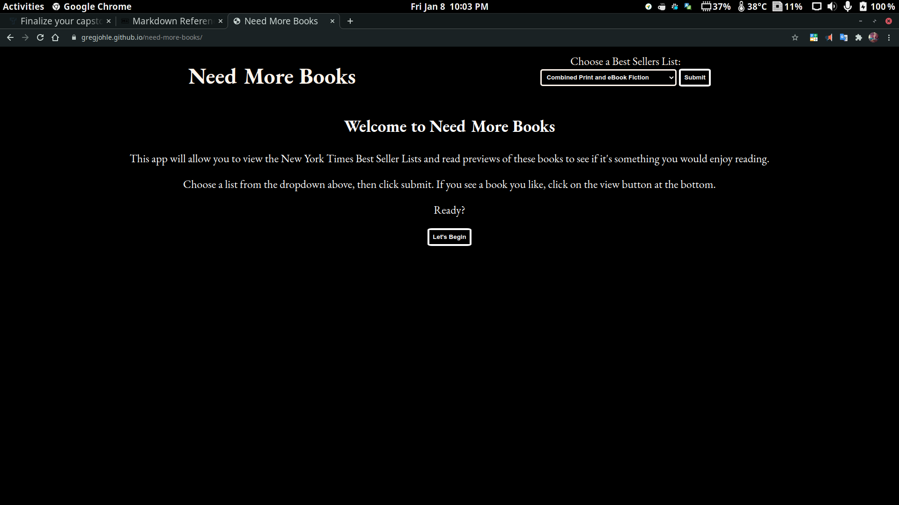
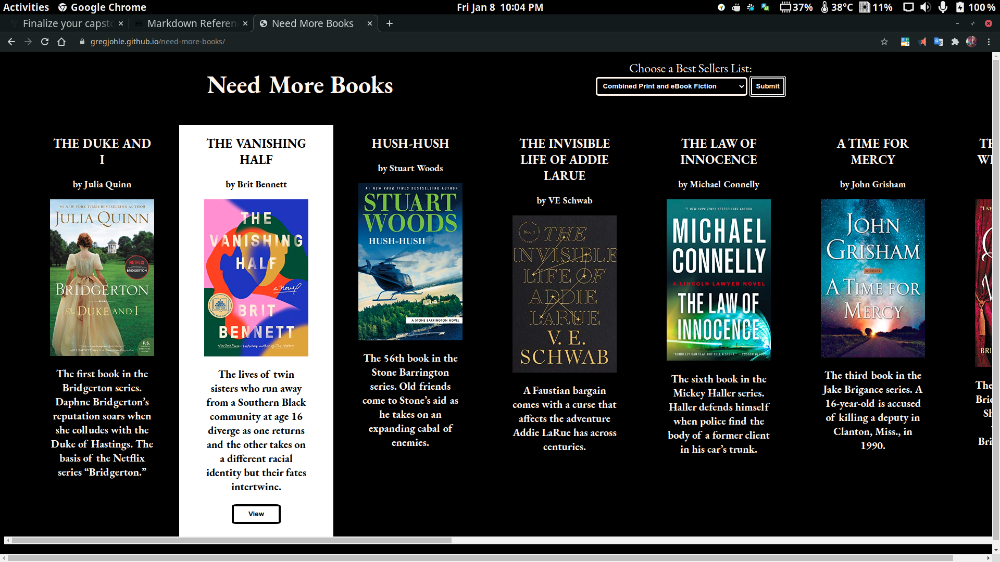
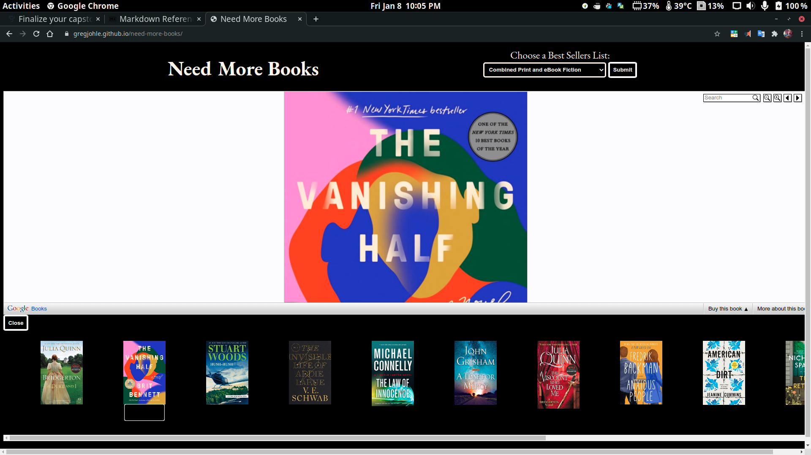

# Need More Books
---
An application that combines known resources to allow users to preview books quickly.

## Motivation
---
I enjoy reading. My whole family loves reading. I wanted to create an app that will help people who love to read find new books that they would enjoy.

## Screenshots
--- 
Intro

Results

Viewer

## Summary
---
This is an app to allow users the ability to read previews of popular books to see if they would want to read them.

It allows users to do this by providing a populated list of all the books on any one of the New York Times Best Seller lists through the books API. 

The books can then be viewed through the Google Books Viewer API.

## Function

The books API uses a query header to select a specific list, and a header for an API key.

The app uses the info from an HTML selector to provide the data to the app.

The resulting JSON has a lot of deeply nested data. I use some of it to give the user basic information about each book. 

The books API requires an ISBN to search for a book. I transition the ISBN obtained from the Books API Json to the viewer API through a hidden object in the results list. 

The viewer API also provides links to find more information on a specific book, as well as a few links to purchase the book.

I do not get any monetary value from someone buying a book through this app. 

## Technologies Used
---
- HTML
- CSS
- JavaScript
- JQuery

## Demo
---
The live app can be viewed [Here](https://gregjohle.github.io/need-more-books)

## Authors
---
Greg Johle - Full Stack Web Developer